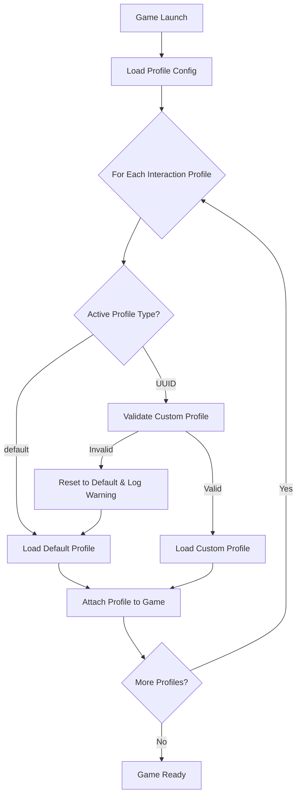

# Custom Profile Management System - Product Requirements Document

## 1. Product Overview

A comprehensive profile management system that extends the existing VR interaction profile functionality to allow users to create, customize, and switch between multiple controller binding profiles. This system enables users to create personalized control schemes for different VR controllers while maintaining compatibility with default Vivecraft profiles.

The system addresses the need for flexible VR controller customization, allowing users to create multiple profiles for different use cases, games, or personal preferences, while ensuring seamless integration with the existing ReQuest mod infrastructure.

## 2. Core Features

### 2.1 User Roles

| Role | Registration Method | Core Permissions |
|------|---------------------|------------------|
| VR User | Automatic (mod installation) | Can create, edit, delete, and switch between custom profiles |

### 2.2 Feature Module

Our custom profile management system consists of the following main components:

1. **Profile Configuration Manager**: Active profile tracking, profile validation, configuration persistence
2. **Custom Profile Storage**: Profile creation, UUID management, file organization
3. **Profile Loading System**: Runtime profile loading, default fallback, validation checks
4. **Profile Management Interface**: Profile switching, profile listing, profile operations

### 2.3 Page Details

| Component Name | Module Name | Feature description |
|----------------|-------------|---------------------|
| Profile Configuration Manager | Active Profile Tracking | Track currently active profile for each interaction profile path. Store configuration in JSON format with profile path and active identifier mapping |
| Profile Configuration Manager | Profile Validation | Validate UUID existence, verify base profile compatibility, reset invalid configurations to default |
| Profile Configuration Manager | Configuration Persistence | Load and save profile configuration file, handle file I/O operations, maintain configuration integrity |
| Custom Profile Storage | Profile Creation | Create new custom profiles with UUID generation, name assignment, base profile inheritance |
| Custom Profile Storage | UUID Management | Generate unique identifiers for custom profiles, ensure UUID uniqueness, handle UUID-based file naming |
| Custom Profile Storage | File Organization | Organize custom profiles in dedicated subdirectories, maintain clean file structure, support profile discovery |
| Profile Loading System | Runtime Profile Loading | Load active profiles during game initialization, integrate with existing DefaultBindingManager, handle profile attachment |
| Profile Loading System | Default Fallback | Automatically fallback to default profiles when custom profiles are invalid or missing |
| Profile Loading System | Validation Checks | Verify profile integrity, check base profile compatibility, validate binding format |
| Profile Management Interface | Profile Switching | Allow users to switch between available profiles, update active profile configuration, apply changes immediately |
| Profile Management Interface | Profile Listing | Display available custom profiles, show profile metadata, organize profiles by base type |
| Profile Management Interface | Profile Operations | Support profile creation, editing, deletion, duplication, import/export functionality |

## 3. Core Process

### Main User Operation Flow

**Profile Creation Flow:**
1. User selects base interaction profile (e.g., Oculus Touch Controller)
2. System creates new custom profile with generated UUID
3. User customizes bindings through interface
4. System saves profile to custom directory with UUID.json naming
5. Profile becomes available for selection

**Profile Switching Flow:**
1. User accesses profile management interface
2. System displays available profiles for current interaction profile
3. User selects desired profile (default or custom UUID)
4. System updates configuration file with new active profile
5. Changes take effect on next game launch or immediate reload

**Game Launch Flow:**
1. System loads profile configuration file
2. For each interaction profile, system checks active profile setting
3. If "default", loads standard Vivecraft profile
4. If UUID, validates and loads custom profile
5. If validation fails, resets to default and logs warning
6. Profiles are attached to game systems



## 4. User Interface Design

### 4.1 Design Style

- **Primary Colors**: Dark theme with blue accents (#2563eb primary, #1e40af secondary)
- **Button Style**: Rounded corners with subtle shadows, hover effects
- **Font**: System default monospace for technical data, sans-serif for UI text
- **Layout Style**: Card-based design with clear sections, vertical navigation
- **Icons**: Simple line icons for actions (create, edit, delete, switch)

### 4.2 Page Design Overview

| Component Name | Module Name | UI Elements |
|----------------|-------------|-------------|
| Profile Configuration Manager | Configuration Display | JSON-style code blocks with syntax highlighting, validation status indicators, error messages in red |
| Custom Profile Storage | Profile Cards | Card layout with profile name, UUID (truncated), base profile, creation date, action buttons |
| Profile Loading System | Loading Indicators | Progress bars, status messages, validation checkmarks, error icons |
| Profile Management Interface | Profile List | Sortable table with columns for name, type, base profile, status, actions. Search/filter functionality |
| Profile Management Interface | Profile Editor | Form-based editor with binding list, drag-and-drop reordering, input path selectors |

### 4.3 Responsiveness

Desktop-first design optimized for Minecraft mod configuration interfaces. No mobile optimization required as this is a PC gaming mod. Focus on clear readability and efficient workflow for profile management tasks.

## 5. Data Structure Requirements

### 5.1 Profile Configuration Format

```json
[
    {
        "profile": "/interaction_profiles/oculus/touch_controller",
        "active": "default"
    },
    {
        "profile": "/interaction_profiles/htc/vive_controller", 
        "active": "a1b2c3d4-e5f6-7890-abcd-ef1234567890"
    }
]
```

### 5.2 Custom Profile Format

```json
{
    "name": "Custom Profile Name",
    "uuid": "a1b2c3d4-e5f6-7890-abcd-ef1234567890",
    "base": "/interaction_profiles/oculus/touch_controller",
    "bindings": [
        {
            "action": "/actions/contextual/in/vivecraft.key.climbeyGrab",
            "inputPath": "/user/hand/right/input/squeeze"
        }
    ]
}
```

### 5.3 Directory Structure

```
interaction_profiles/
├── oculus/
│   ├── touch_controller.json (default profile)
│   └── custom/
│       ├── uuid1.json
│       └── uuid2.json
├── htc/
│   ├── vive_controller.json (default profile)
│   └── custom/
│       └── uuid3.json
└── profile_config.json (active profile configuration)
```

## 6. Validation Rules

### 6.1 Profile Validation

- UUID must be valid format and correspond to existing custom profile file
- Base profile path must match the interaction profile directory
- Custom profile file must exist in correct custom subdirectory
- Bindings array must contain valid action and inputPath combinations
- Profile name must be non-empty string

### 6.2 Fallback Behavior

- Invalid UUID → Reset to "default" and log warning
- Missing custom profile file → Reset to "default" and log error
- Mismatched base profile → Reset to "default" and log error
- Corrupted profile data → Reset to "default" and log error
- Missing configuration file → Create new with all profiles set to "default"

## 7. Integration Requirements

### 7.1 DefaultBindingManager Integration

- Extend existing DefaultBindingManager class with custom profile functionality
- Maintain backward compatibility with existing default profile system
- Integrate custom profile loading into existing binding resolution flow
- Preserve existing conflict detection and namespace management

### 7.2 Game Launch Integration

- Hook into existing game initialization process
- Load active profiles before binding attachment
- Ensure custom profiles are applied consistently
- Maintain performance during game startup