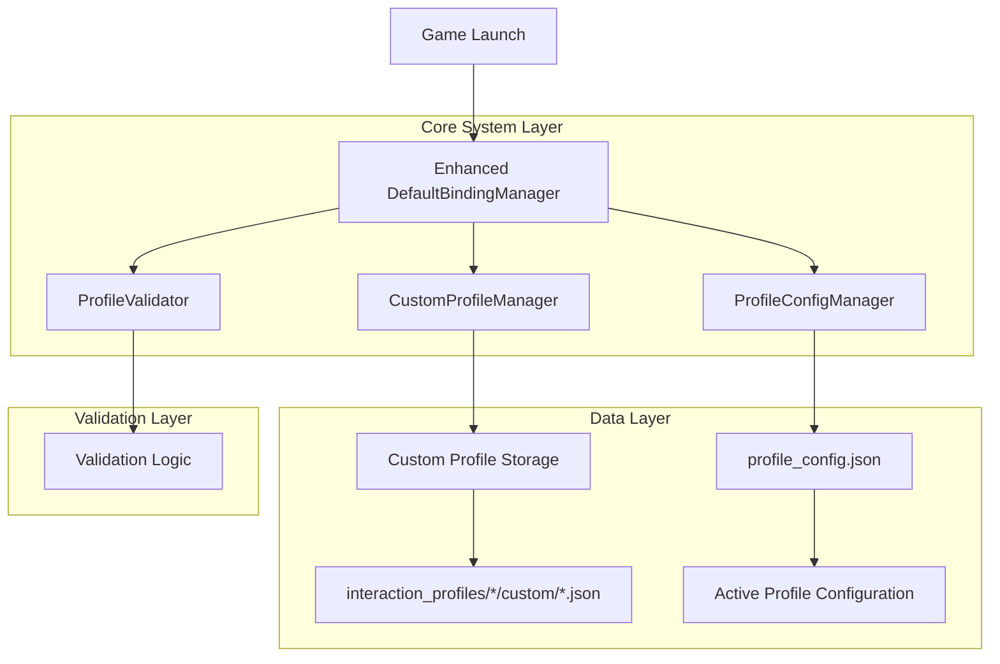
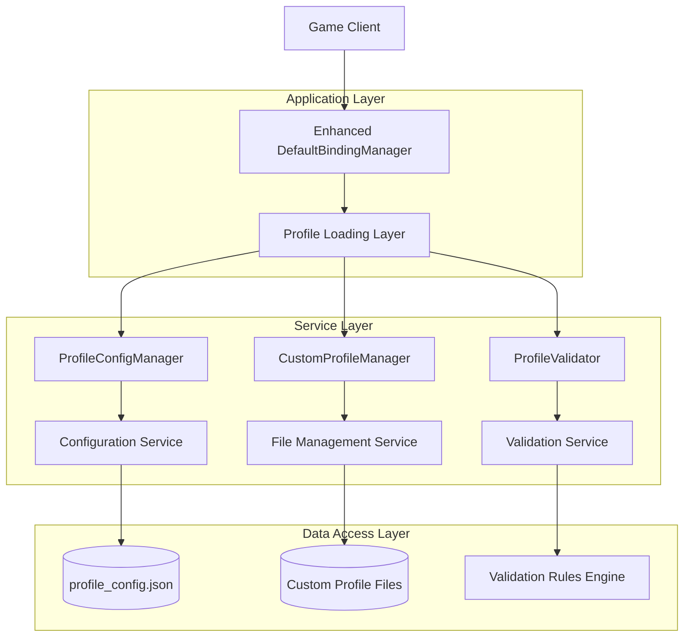
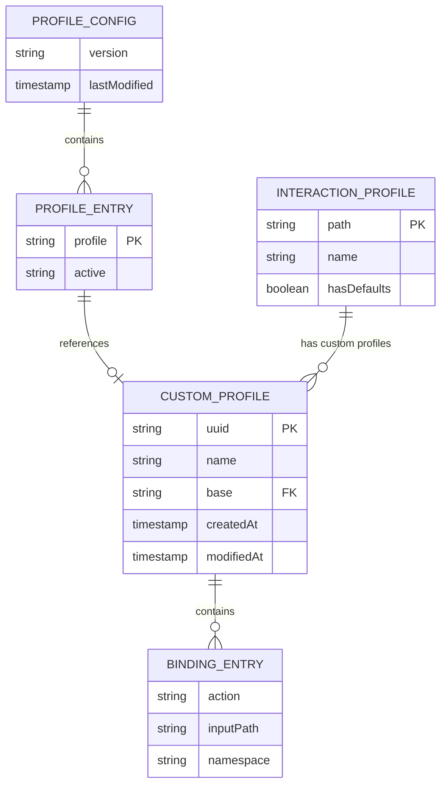

# Custom Profile Management System - Technical Architecture Document

## 1. Architecture Design



## 2. Technology Description

- **Frontend**: Java 17+ (Minecraft Mod Environment)
- **Backend**: Fabric Mod Framework
- **Data Storage**: JSON file-based storage
- **Libraries**: Gson for JSON serialization, Apache Commons for utilities
- **Integration**: Existing DefaultBindingManager extension

## 3. Route Definitions

| Component | Purpose |
|-----------|---------|
| ProfileConfigManager | Manages active profile configuration and persistence |
| CustomProfileManager | Handles custom profile CRUD operations and file management |
| ProfileValidator | Validates profile integrity and compatibility |
| Enhanced DefaultBindingManager | Extended binding manager with custom profile support |

## 4. API Definitions

### 4.1 Core API

**Profile Configuration Management**
```java
// Load active profile configuration
public ProfileConfig loadProfileConfig()

// Save active profile configuration  
public void saveProfileConfig(ProfileConfig config)

// Get active profile for interaction profile
public String getActiveProfile(String interactionProfilePath)

// Set active profile for interaction profile
public void setActiveProfile(String interactionProfilePath, String activeProfileId)
```

**Custom Profile Management**
```java
// Create new custom profile
public CustomProfile createCustomProfile(String name, String baseProfile, List<BindingEntry> bindings)

// Load custom profile by UUID
public CustomProfile loadCustomProfile(String uuid, String interactionProfilePath)

// Save custom profile
public void saveCustomProfile(CustomProfile profile)

// Delete custom profile
public boolean deleteCustomProfile(String uuid, String interactionProfilePath)

// List all custom profiles for interaction profile
public List<CustomProfile> listCustomProfiles(String interactionProfilePath)
```

**Profile Validation**
```java
// Validate custom profile
public ValidationResult validateCustomProfile(String uuid, String interactionProfilePath)

// Validate profile configuration
public ValidationResult validateProfileConfig(ProfileConfig config)

// Reset invalid profiles to default
public void resetInvalidProfiles(ProfileConfig config)
```

### 4.2 Data Models

**ProfileConfig**
```java
public class ProfileConfig {
    private List<ProfileEntry> profiles;
    
    public static class ProfileEntry {
        private String profile;      // interaction profile path
        private String active;       // "default" or UUID
    }
}
```

**CustomProfile**
```java
public class CustomProfile {
    private String name;
    private String uuid;
    private String base;
    private List<BindingEntry> bindings;
    private long createdAt;
    private long modifiedAt;
}
```

**ValidationResult**
```java
public class ValidationResult {
    private boolean valid;
    private String errorMessage;
    private ValidationErrorType errorType;
    
    public enum ValidationErrorType {
        INVALID_UUID,
        MISSING_FILE,
        BASE_MISMATCH,
        CORRUPTED_DATA,
        INVALID_BINDINGS
    }
}
```

## 5. Server Architecture Diagram



## 6. Data Model

### 6.1 Data Model Definition



### 6.2 Data Definition Language

**Profile Configuration File Structure**
```json
-- profile_config.json
{
  "version": "1.0",
  "lastModified": 1703123456789,
  "profiles": [
    {
      "profile": "/interaction_profiles/oculus/touch_controller",
      "active": "default"
    },
    {
      "profile": "/interaction_profiles/htc/vive_controller",
      "active": "a1b2c3d4-e5f6-7890-abcd-ef1234567890"
    }
  ]
}
```

**Custom Profile File Structure**
```json
-- interaction_profiles/oculus/custom/{uuid}.json
{
  "name": "Custom Pico 4 Profile",
  "uuid": "a1b2c3d4-e5f6-7890-abcd-ef1234567890",
  "base": "/interaction_profiles/oculus/touch_controller",
  "createdAt": 1703123456789,
  "modifiedAt": 1703123456789,
  "bindings": [
    {
      "action": "/actions/contextual/in/vivecraft.key.climbeyGrab",
      "inputPath": "/user/hand/right/input/squeeze",
      "namespace": "vivecraft"
    },
    {
      "action": "/actions/ingame/in/key.attack",
      "inputPath": "/user/hand/right/input/trigger",
      "namespace": "minecraft"
    }
  ]
}
```

**Directory Structure Creation**
```bash
-- Create directory structure
mkdir -p interaction_profiles/oculus/custom
mkdir -p interaction_profiles/htc/custom
mkdir -p interaction_profiles/valve/custom

-- Initialize profile configuration
touch interaction_profiles/profile_config.json

-- Example custom profile files
touch interaction_profiles/oculus/custom/a1b2c3d4-e5f6-7890-abcd-ef1234567890.json
touch interaction_profiles/htc/custom/b2c3d4e5-f6g7-8901-bcde-f23456789012.json
```

## 7. Implementation Classes

### 7.1 ProfileConfigManager
```java
public class ProfileConfigManager {
    private static final String CONFIG_FILE = "interaction_profiles/profile_config.json";
    private ProfileConfig config;
    
    public ProfileConfig loadConfig();
    public void saveConfig(ProfileConfig config);
    public String getActiveProfile(String interactionProfilePath);
    public void setActiveProfile(String interactionProfilePath, String activeProfileId);
    public void resetToDefault(String interactionProfilePath);
}
```

### 7.2 CustomProfileManager
```java
public class CustomProfileManager {
    private static final String CUSTOM_DIR = "custom";
    
    public CustomProfile createProfile(String name, String baseProfile, List<BindingEntry> bindings);
    public CustomProfile loadProfile(String uuid, String interactionProfilePath);
    public void saveProfile(CustomProfile profile);
    public boolean deleteProfile(String uuid, String interactionProfilePath);
    public List<CustomProfile> listProfiles(String interactionProfilePath);
    private Path getCustomProfilePath(String interactionProfilePath, String uuid);
    private String generateUUID();
}
```

### 7.3 ProfileValidator
```java
public class ProfileValidator {
    public ValidationResult validateCustomProfile(String uuid, String interactionProfilePath);
    public ValidationResult validateProfileConfig(ProfileConfig config);
    public void resetInvalidProfiles(ProfileConfig config);
    private boolean isValidUUID(String uuid);
    private boolean profileFileExists(String uuid, String interactionProfilePath);
    private boolean baseProfileMatches(CustomProfile profile, String expectedBase);
}
```

### 7.4 Enhanced DefaultBindingManager
```java
public class DefaultBindingManager {
    private ProfileConfigManager configManager;
    private CustomProfileManager customProfileManager;
    private ProfileValidator validator;
    
    // Existing methods...
    
    // New methods for custom profile support
    public Collection<Pair<String, String>> loadActiveProfile(String headsetProfile);
    public void initializeCustomProfileSystem();
    public List<CustomProfile> getAvailableCustomProfiles(String headsetProfile);
    public void switchToProfile(String headsetProfile, String profileId);
}
```

## 8. Error Handling Strategy

### 8.1 Validation Errors
- **Invalid UUID**: Log warning, reset to default, continue operation
- **Missing Profile File**: Log error, reset to default, create backup entry
- **Base Profile Mismatch**: Log error, reset to default, notify user
- **Corrupted Profile Data**: Log error, reset to default, quarantine file

### 8.2 File System Errors
- **Permission Issues**: Log error, fallback to read-only mode
- **Disk Space**: Log error, prevent new profile creation
- **File Corruption**: Log error, attempt recovery, fallback to default

### 8.3 Runtime Errors
- **Profile Loading Failure**: Graceful degradation to default profiles
- **Configuration Corruption**: Rebuild configuration from available profiles
- **UUID Conflicts**: Generate new UUID, update references

## 9. Performance Considerations

### 9.1 Lazy Loading
- Load custom profiles only when needed
- Cache frequently accessed profiles
- Defer validation until profile activation

### 9.2 File I/O Optimization
- Batch file operations where possible
- Use asynchronous I/O for non-critical operations
- Implement file watching for configuration changes

### 9.3 Memory Management
- Limit number of cached profiles
- Use weak references for infrequently accessed data
- Clean up temporary objects promptly